# Bugcrowd MCP Architecture Flow Diagram

```mermaid
graph TB
    %% User Layer
    User[👤 Security Researcher]
    
    %% AI Agent Layer  
    Agent[🤖 AI Agent<br/>Bugcrowd Security Assistant]
    
    %% MCP Protocol Layer
    MCP[📡 MCP Protocol<br/>Model Context Protocol]
    
    %% MCP Server Layer
    Server[🔧 Bugcrowd MCP Server<br/>bugcrowd_mcp_server.py]
    
    %% API Client Layer
    HTTP[🌐 HTTP Client<br/>httpx AsyncClient]
    
    %% External API
    BugcrowdAPI[🎯 Bugcrowd REST API<br/>api.bugcrowd.com]
    
    %% Data Flow
    User -->|Natural Language Queries| Agent
    Agent <-->|Tool Calls & Responses| MCP
    MCP <-->|Function Invocations| Server
    Server -->|Authenticated Requests| HTTP
    HTTP -->|HTTPS/JSON| BugcrowdAPI
    
    %% Tool Categories
    subgraph "🛠️ Available Tools"
        direction TB
        OrgTools[Organizations<br/>• get_organizations<br/>• get_organization]
        ProgTools[Programs<br/>• get_programs<br/>• get_program]
        SubTools[Submissions<br/>• get_submissions<br/>• create_submission<br/>• update_submission]
        ReportTools[Reports<br/>• get_reports<br/>• get_report]
        AssetTools[Assets<br/>• get_customer_assets<br/>• get_customer_asset]
        RewardTools[Rewards<br/>• get_monetary_rewards<br/>• get_monetary_reward]
        UserTools[Users<br/>• get_users<br/>• get_user]
    end
    
    Server -.->|Exposes| OrgTools
    Server -.->|Exposes| ProgTools
    Server -.->|Exposes| SubTools
    Server -.->|Exposes| ReportTools
    Server -.->|Exposes| AssetTools
    Server -.->|Exposes| RewardTools
    Server -.->|Exposes| UserTools
    
    %% Authentication
    subgraph "🔐 Authentication"
        EnvVars[Environment Variables<br/>BUGCROWD_API_USERNAME<br/>BUGCROWD_API_PASSWORD]
        Auth[Token Authentication<br/>Authorization: Token user:pass]
    end
    
    EnvVars --> Auth
    Auth --> HTTP
    
    %% Configuration
    subgraph "⚙️ Configuration"
        Config[API Configuration<br/>Base: api.bugcrowd.com<br/>Version: 2025-04-23<br/>Accept: application/vnd.bugcrowd+json]
    end
    
    Config --> HTTP
    
    style User fill:#e1f5fe
    style Agent fill:#f3e5f5
    style Server fill:#e8f5e8
    style BugcrowdAPI fill:#fff3e0
    style EnvVars fill:#ffebee
```

## Architecture Components

### 1. User Interface Layer
- **Implementation**: Any MCP-compatible client
- **Purpose**: Interactive CLI for security researchers
- **Functionality**: Natural language query processing

### 2. AI Agent Layer
- **Implementation**: Any MCP-compatible client
- **Purpose**: AI agent with security research instructions
- **Functionality**: Interprets user queries and calls appropriate tools

### 3. MCP Protocol Layer
- **Implementation**: Any MCP-compatible client
- **Purpose**: Model Context Protocol for tool communication
- **Functionality**: Bridges AI Agent and MCP Server

### 4. MCP Server Layer
- **File**: `bugcrowd_mcp_server.py`
- **Purpose**: FastMCP server implementation
- **Functionality**: Exposes 14 tools across 7 API categories

### 5. HTTP Client Layer
- **File**: `bugcrowd_mcp_server.py`
- **Purpose**: Async HTTP client with authentication
- **Functionality**: Handles API versioning and error handling

### 6. External API Layer
- **Service**: Bugcrowd REST API
- **Endpoint**: `api.bugcrowd.com`
- **Protocol**: JSON API specification with token-based authentication

## Data Flow

1. **User Input**: Security researcher enters natural language queries
2. **Agent Processing**: AI agent interprets queries and determines appropriate tools
3. **MCP Communication**: Agent communicates with MCP server via protocol
4. **Tool Execution**: MCP server executes specific API calls
5. **HTTP Requests**: Authenticated requests sent to Bugcrowd API
6. **Response Chain**: Data flows back through each layer to the user

## Security Features

- **Environment Variable Authentication**: Credentials stored securely
- **Token-Based API Access**: Secure authentication with Bugcrowd
- **Defensive Security Focus**: Tools designed for vulnerability management
- **Async Request Handling**: Efficient and secure API communication